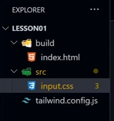

- next up: https://www.youtube.com/watch?v=VCpfd1NgBD8

# install tailwind

```js
npx tailwindcss init
```

# folder structure



- tailwind compiles the CSS from the input.css file.
- creates the CSS for us inside the build directory
- inside input.css we require the following so tailwind can do its magic

```js
@tailwind base;
@tailwind components;
@tailwind utilities;
```

- we can also write our own CSS inside input.css

- in the terminal:

```js
npx tailwindcss -i ./src/input.css -o ./build/css/style.css
```

- this creates a style.css file inside our build/css folder
- these are base styles

  - as we use more styles from tailwind, it will add them in style.css when we compile

- update the tailwind.config.js to add the build folder:

```js
/** @type {import('tailwindcss').Config} */
module.exports = {
  content: ["./build/*.html"],
  theme: {
    extend: {},
  },
  plugins: [],
};
```

- add content to index.html with Tailwind classes:

```html
<div class="bg-emerald-500 w-52 h-52"></div>
```

- and compile:

```js
npx tailwindcss -i ./src/input.css -o ./build/css/style.css --watch
```

- use of --watch will cause CSS to be recompiled

- install Tailwind intellisense extension

- you can use https://tailwindcss.com/ to search for the effect you want to create, eg gradients
- TW doesn't supply everything, eg no radial gradient predefined

- all of these TW classes make our html look messy:

```html
<body class="min-h-screen border-red-500 grid place-content-center radial-blue">
  <div
    class="bg-emerald-500 w-52 h-52 rounded-full shadow-2xl grid place-content-center"
  >
    <div class="bg-teal-200 w-32 h-32 rounded-full grid place-content-center">
      <div class="bg-red-500 w-16 h-16 rounded-full"></div>
    </div>
  </div>
</body>
```

- can work around with extension in VSCode: Inline fold
